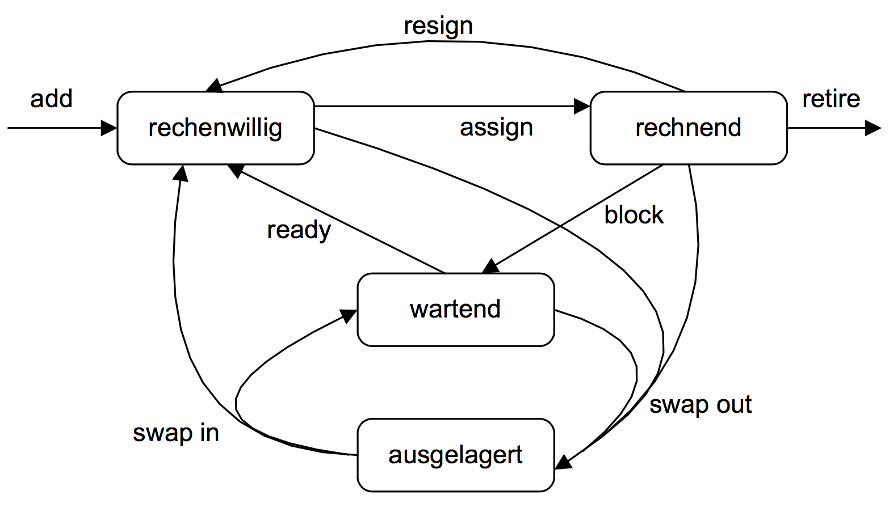

# 03 Prozess- und Prozessorverwaltung
* Konzepte zur Verwaltung von Prozessen u. Threads
* Scheduler
* Dispatcher

# 3.1 Prozesse
* Definition:
    * Programm in Ausführung
    * Zur Erfüllung seiner Aufgaben benötigt er Ressourcen
    * Er besitzt seinen eigenen Prozessadressraum, besitzt nur exklusiven Zugriff auf seine eigenen Daten. Datenaustausch mit anderen Prozessen ist über BS-Dienste oder IPC möglich.
    * Prozesse gruppieren Ressourcen
        * Adressraum (Programmcode, Daten)
        * Gemeinsam nutzbare Ressourcen f. alle Threads eines Prozesses 
* **Prozesszustände** in seiner jew. Lebenszeit

    * `add`: Neu erzeugter P wird zur Menge der rechenwilligen P hinzugefügt
    * `assign`: Als Folge eines Kontextwechsels wird dem P die CPU zugeordnet
    * `block`: Aufgrund eines E/A-Aufrufs wird der P auf wartend gesetzt
    * `ready`: P wechselt nach Beendigung der angestoßenen Operation in den Zustand rechenwillig
    * `resign`: Die CPU wird dem rechnenden P entzogen
    * `retire`: Der rechnende P terminiert
    * `swap out`: P wird auf die Festplatte ausgelagert
* Thread
    * Abstraktion eines physischen Prozesses (leichtgewichtiger Prozess)
    * Repräsentation nebenläufiger Ausführungspfade eines Rechensystems
    * **Multi-threaded Prozess** besitzt mehrere Kontrollflüsse. 
    * **T eines P teilen sich dessen Adressraum**, läuft im Adressraum seines Prozesses ab.
    * **Jeder T besitzt seinen eigenen BZ**
* **Thread-Kontext** mit thread-spezifischen Informationen:
    * PC
    * Registerwerte
    * Stack
    * Threadzustand
    * Kontext muss gerettet werden, sobald einem T die CPU entzogen wird.
* Gründe für Multi-Threading:
    * **Overhead**: Einfache Kommunikation, geringer Initialisierungsaufwand, schneller Kontextwechsel
    * **Performance**: Multithreading führt zu quasi-paralleler Ausführung von I/O-intensive u. CPU-intensive Bereiche eines Prozesses.

## 3.2 Implementierung von Prozessen
* **Prozesskontrollblock PCB**
    * Informationen zur *Prozessverwaltung*
        1. Registerinhalte
        2. Prozesszustand
        3. Priorität
        4. PID
        5. PPID
        6. PGID
    * Informationen zur *Speicherverwaltung*
        * Pointer zu Code, Daten und Stack Segment Informationen
    *  Informationen für die *Dateiverwaltung*
        * Root dir.
        * Filedeskriptoren zu offenen Dateien.
        * UID, GID (Benutzer / Gruppen-ID)
* **Prozesstabelle**: Verkettete Liste von PCBen
    * Run Queue (Ready Queue): rechenwillige Prozesse 
    * Wait Queue: Wartende Prozesse

## 3.3 Dienste der Prozessverwaltung
* Dienste zur Erzeugung, Terminierung von Prozessen
* **Scheduling**: Auswahl des nächsten Prozesses aus der Menge der rechenbereiten Prozesse (Prozessorzuteilung)
* **Dispatching**: Umsetzung des Kontext- und Zustandswechsels
* Auslösende Ereignisse für die Prozesserzeugung:
    * während Systeminitialisierung
        * Vordergrundprozesse
        * Hintergrundprozesse (daemons)
    * durch andere Prozesse
    * durch Benutzer
    * durch das Betriebssystem
### Prozessterminierung
* Normale Beendigung (freiwillig)
    * durch Aufruf eines best. Systemcalls
    * `exit`, `ExitProcess`
* Vorzeitige Beendigung (freiwillig)
    * durch den Prozess erkannter Fehler
* Vorzeitige Beendigung
    * katastrophaler Fehler im Programm, erkannt durch das BS
    * Segmentation Fault
* Terminierung durch anderen Prozess
    * `kill` / Task-Manager

### Prozesshierarchie
#### Prozesshierarchie unter UNIX

Jeder Prozess bekommt eine eindeutige `PID` (Prozess-ID), die die P identifiziert.

Jeder Prozess hat einen Vater-Prozess (außer `init`-Prozess mit `PID = 1` und `PPID = 0`), dieser wird durch die `PPID` verwaltet.

Jeder Prozess formt mit seinen Kindern eine Prozessgruppe, beschrieben durch `PGID`. Der Vater-Prozess ist dann der Prozessgruppen-Leader.

Anmerkungen:
* Zuerst: Initialisierung aller Subsysteme des Kernels, dann Erzeugung des ersten Userspace Prozesses `init`. `init`-Prozess erzeugt einen Prozess pro Bildschirm zum Login, der dann eine `shell` erzeugt.
* **Zombie**: Kind terminiert vor dem Vater-Prozess, Solange der Vaterprozess aktiv ist und nicht auf das Ende seines Kindes wartet, wird der Kindprozess zu einem Zombie, solange der Vater-Prozess aktiv ist. Das Kind belegt aber noch einen Platz in der Prozesstabelle. 
* **Waisen**: Kind-Prozess wird zum Waisen, wenn Vater vor dem Kind-Prozess terminiert. Kind wird von `init`-Prozess adoptiert (`PPID = 1`).
* **Dämon**: Hintergrundprozess

#### Prozesserzeugung unter Windows
* Keine Prozesshierarchie
* **Handle**-Zuordnung zu einem Prozess sobald er erstellt wird. Kontrolle des Kind-Prozesses über diesen möglich.

## 3.4 Dienste zur Prozessverwaltung
* Dispatcher: Realisiert Prozess-Zstübergänge von rechenwillig nach rechnend. 
* Scheduler: Auswahl eines Prozesses aus der Liste der rechenwilligen Prozesse (Run Queue) durch Scheduling Algorithmen. 

### Dispatching
* Ein Dispatcher implementiert einen **Kontextwechsel**, also einen Zustandsübergang eines P's/T's **von rechnend nach rechenwillig**.
* Vorgang: Dem rechnenden Prozess / Thread wird die CPU entzogen und einem rechenbereiten Prozess zugeteilt.
* T's haben kleineren Kontext im Vergleich zu P's, also erfolgt Kontextwechsel im gleichen Prozess sehr schnell.
* Kontextwechsel zwischen T's verschiedener P's ist genauso teuer wie Prozesswechsel.
* Implementierung:
    1. Zustandsänderung des P/T `P'` von rechnend zu wartend/rechenbereit.
    2. Sicherung des **Kontexts** von `P'` im PCB.
    3. Laden des Kontexts des rechenbereiten P/T `P`.
    4. Zustandsänderung von `P` von wartend/rechenbereit nach rechnend.

### Scheduling
* Welcher P/T bekommt die CPU? An welche CPU wird der P gebunden?
* **CPU-bound** / **I/O-bound Prozesse**
* Scheduling-Trigger:
    * Prozesserzeugung
    * Prozessterminierung
    * Prozessblockierung
    * Interrupt

## 3.5 Implementierung von Threads
Implementierungsvarianten:
* User Space
* Kernel Space
* Hybride Varianten (User- und Kernel-Space)

Scheduler sollte die Thread-Zugehörigkeit zu Prozessen berücksichtigen, um Overhead für Kontextwechsel zu minimieren.

### User-level Threads
* Der BS-Kern sieht nur single-threaded Prozesse.
* Ein **Thread-Paket** (= **Laufzeitsystem**) implementiert die Operationen, die erforderlich sind um Threads zu realisieren.
* T's werden im User Space durch das Laufzeitsystem verwaltet. Jede davon hat eine eigene **Threadtabelle** pro Prozess.
* Es implementiert einen eigenen Thread-Scheduler (**two-level scheduling**).
* Scheduling von User-level Threads - Thread kann vom Laufzeitsystem nicht unterbrochen werden.
    1. Kernel picks a process
    2. Runtime system picks a thread.
* Der Kernel sieht also das Laufzeitsystem als einen Prozess, den er schedulen muss.
* Kann also in OS implementiert werden, wo der BS-Kernel gar keine Threads supportet.
* Schnelles thread-level Scheduling (weil nicht im Kernel mode).
* Prozesse können ihren eigenen Scheduling-Algorithmus haben.

### Kernel-level Threads
* BS-Kern verwaltet selbst die Threads und hat eine Threadtabelle für alle Threads im Kern. 
* Thread Operationen führen zu einem Trap im Kern. 
* BS-Kern wählt rechenwilligen Thread und kontrolliert CPU-Zuteilung an Threads.
* Wenn ein Kernel-Level-Thread blockiert, so kann die CPU einem anderen Thread des gleichen Prozesses zugeordnet werden, ohne den gesamten Prozess aufzuhalten.

### Hybride Implementierung
* Mapping von Kernel-Threads auf User-Threads.
* BS-Kern verwaltet nur Kernel-Threads.

## 3.6 Scheduling

### Optimierungsziele

* Alle:
    * Fairness: Fairer Anteil der CPU für jeden Prozess.
    * Balance: Effektive Auslastung der System-Teile (I/O, CPU).
* Batchsysteme
    * Durchsatz (Maximierung d. Anz. an Aufträgen)
    * Ausführungszeit (Minimierung)
    * CPU-Belegung (Konstanthalten d. Belegung)
* Interaktive Systeme
    * Antwortzeit (Minimierung)
    * Proportionalität (Berücksichtigung d. Erwartungshaltung von Benutzern)
* Echtzeitsysteme
    * Halten v. Deadlines (Vermeidung von Datenverlust)
    * Vorhersagbarkeit (Vermeidung v. Qualitätsverlusten)

### Scheduling-Kriterien

* Fairness vs. Priorität
    * Faire Verteilung d. CPU an alle Prozesse einer Klasse
    * ABER: Höhere Priorisierung von Prozessen mit höherer Priorität
* I/O- vs. CPU-bound processes zur guten Auslastung
* Wartezeit zur Vermeidung von Verhungern
* CPU-Belegung vs. Durchsatz
    * Dauerhafte Belegung d. CPU nicht gleichbedeutend mit hohem Durchsatz.

### Scheduling-Klassen

* **Non-preemptive**: P werden so lange ausgeführt, bis sie aufgrund von I/O-Operationen oder Synchronisationsmechanismen blockieren oder terminieren.
* **Preemptive**: P werden beim Auftreten von Ereignissen unterbrochen. Rechnenden P kann also durch einen preemptive Scheduler die CPU entzogen und einem anderen rechenwilligen Prozess zugewiesen werden.

### Scheduling-Strategien

* Batch-Systeme:
  * FCFS (n-p.)
  * SJF (n-p.)
  * SRTN (p.)
* Interaktive Systeme:
  * RR-Scheduling (p. nach Ablauf einer Zeitscheibe)
  * Priority Scheduling (p.)
* Echtzeit-Systeme:
  * EDF (Earliest-Deadline-First, p. oder n-p.)
  * RMS

#### Soft Deadlines
Es wird toleriert, dass nicht alle Deadlines eingehalten werden.

#### Harte Deadlines
Müssen eingehalten werden.