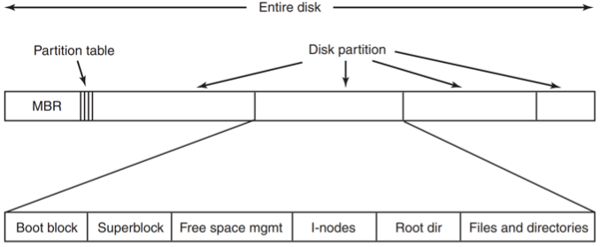
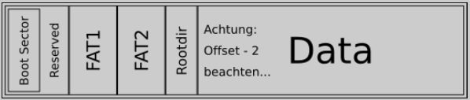

# 07 - Dateisysteme
Objective:
* Langlebige, persistente Datenspeicherung
* Bereitstellung v. Speicherspatz für sehr große Datenmengen
* Vermeiden v. Datenverlust
* Ermöglichung v. nebenläufigem Zugriff auf Daten.

**Datei**:

* Logische Verwaltungseinheit
* Persistente Speicherung von beliebigen Informationen

## 7.2 Dateien

**Dateisystem**:

* Dateien werden vom BS durch Dateisysteme verwaltet.
* Aufgaben d. BS:
    * Dateistrukturen zur Beschreibung von Dateien
    * Implementierung d. Dateien
    * Benennung
    * Ermöglichung v. Zugriffen auf Dateien
    * Schutz vor unber. Zugriff

**Strukturierung** von Dateien:

* Unstrukturiert
    * Datei als Folge von Bytes
* Sequenzen v. Einträgen fester Größe
    * Einträge m. fester Größe und Struktur
* Ein Baum mit Einträgen unterschiedlicher Größe
    * Einträge m. Keys
    * Sortierte Speicherung m. diesen Keys

**Dateitypen**, die von BS unterstützt werden:

* **Dateien**
    * m. Benutzerinformationen
* **Verzeichnisse**
    * Systemdateien zur Verwaltung d. Dateisystems
* **Character Special Files**
    * modellieren serielle I/O-Geräte
* **Block Special Files**
    * modellieren u.a. Festplatten

**Dateizugriff**:

* **Sequential access**
* **Random-access**

**Dateiattribute**:
* Dateiname
* Datei-Inhalt
* (Meta-)informationen
    * Zugriffsrechte
    * Flags
    * Zeiteinträge
    * Dateigröße

**Dateioperationen** angeboten über `Syscalls`:
* Erzeugen u. Löschen
* Open
* Close
* Read
* Write
* Seek

## 7.3 Verzeichnisse
Das BS verwaltet Dateien in einem Dateisystem. Das Dateisystem organisiert Dateien in Verzeichnissen.
* **Single-Level Verzeichnisstrukturen**
    * Ein *root* Verzeichnis, das alle Dateien verwaltet
    * Unstrukturiert
* **Hierarchische Verzeichnisstrukturen**
    * Verwandte Dateien sind in Verzeichnissen gruppiert
    * Benutzuer haben eigenes priv. Verzeichnis m. Unterverzeichnissen

**Pfadnamen**:
* Absolute Pfadnamen
    * Root: `/` (Unix), `\`  (Windows)
* Relative Pfadnamen
    * Bezug auf aktuelles Working Verzeichnis
* Spezielle Einträge in jedem Verzeichnis
    * `.` := Working Verzeichnis
    * `..` := Vater d. Working Verzeichnis

## 7.4 Dateisystem-Implementierung
### Dateisystem-Layout
* Dateisystem gespeichert auf Festplatte.
* Festplatte aufgetelt in Partitionen, ermöglicht das unabhängige Speicern eines Dateisystems pro Partition.
* **Partitions-Tabelle** mit Anfangs- und End-Adresse für jede Partition.
* Sektor 0 der Festplatte: **MBR** (Master Boot Record).
* Erster Block ist **Boot-Block**. 

### Partition-Layout
* Superblock
* Informationen ü. freie Blöcke (free space management)
* Menge an Dateideskriptoren
* Daten der Verzeichnisse u. Dateien

#### FAT16 Partition
1. Reservierter Bereich (Boot-Sector Block)
2. FAT Area
3. Rootdir
4. Datenblöcke

### Datei-Implementierung

Zentrale Frage: Wie werden die Blöcke, die den Datei-Content enthalten, verwaltet?
1. Contiguous Allocation
2. Linked List Allocation
3. i-nodes

Ansätze:
| Name | Beschreibung| Vorteile | Nachteile |
| ---- | ---- | ---- | ---- |
| **Contiguous Allocation** | Datei als zusammenhängende Folge von Blöcken | Geringer Implementierungsaufwand, performantes Lesen | (Externe) Fragmentierung|
| **Linked List Allocation** | Verwaltung d. belegten Blöcke in Linked-List, Erstes Wort im Block als Zeiger auf nächsten Block | Kein Verlust an Speicherplatz | Ineffizient bei Random-Access |
| **i-nodes** | Assoziierung v. Datei mit einer Index-Node mit Dateiattributen und Adressen d. belegten Blöcke | i-node muss nur dann in den Speicher geladen werden, wenn die Datei geöffnet wurde | i-node enthält nur feste Anzahl an Blockadressen |

#### i-Node
* Datenstruktur, die Speicherblock zu Datei zuordnet.
* Speicherung der Dateiattribute und die Adressen der dazugehörigen Blöcken.
* Bei gegebener i-node ist es so möglich, alle Blöcke einer Datei zu finden.
* Gespeicherte Informationen innerhalb einer i-Node (EXT = Extended file system):
    * Typ (FIFO, Character device, Directory, Block device, Regular file, Symbolic link, Socket),
    * Besitzer (User, Group),
    * Dateirechte,
    * Verschiedene Timestamps (created, accessed, modified),
    * Anzahl der Hardlinks, die auf den i-node verweisen,
    * Anzahl d. Blöcke,
    * Verschiedene Flags,

**Linked-List-Allocation** mit **FAT** (File Allocation Table):
* Der Zeiger eines Blocks auf den nächsten Block wird in einem Array im HS verwaltet.
* Diese Tabelle muss aber im RAM gehalten werden.

## 7.5 Verzeichnis-Implementierung
Hauptaufgaben:

* Auflösung von Pfadnamen
* Finden von Dateien auf der Festplatte

**Verzeichniseintrag**:
* Verzeichnisse bestehen aus einer Menge an Verzeichniseinträgen
* **Verzeichniseintrag** enthält:
    * Dateinamen
    * Adressinformationen
        * Adresse auf Festplatte
        * Nummer d. ersten Blocks
        * Nummer d. i-nodes (um die ganze Datei zu lokalisieren)
    * Verweis auf Dateiattribute (z.B. Dateibesitzer, Erzeugungszeitpunkt)

Verwaltung von **Dateiattributen**:
* direkt im Verzeichniseintrag
* in i-nodes (Verzeichniseintrag besteht dann nur aus Dateinamen und der dazigehörigen i-node Nummer)

### Link
Verweis auf bereits existierende Datei im gleichen Dateisystem.
### Hardlink
* Verweis auf eine andere Datei (i-node) im gleichen Dateisystem
* Anzahl der Referenzen auf sich selbst wird in der i-node einer Datei gespeichert.
* Referenz-Counter wird dekremtiert, wenn Hardlink gelöscht wird.
* Beim erreichen vonn 0, wird die Datei entgültig aus dem File system gelöscht und die Blöcke freigegeben.
### Softlink
* Referenz auf eine andere Datei
* Unabhängig davon ob die Datei existiert oder nicht

## Löschvorgang einer Datei unter UNIX
1. Entferne den Eintrag der Datei aus dem Verzeichnis.
2. Hard-Link löschen, Reference Counter dekrementieren
3. Falls `Reference_Counter == 0`:
    * Freigabe des i-node in den Pool der freien i-nodes.
    * Markierung der durch die Datei belegten Blöcke als frei.

## 7.6 Journaling Dateisystem

## Journaling Dateisystem
* Alle Änderungen d. Dateisystems (Daten und Metadaten) werden in einem Speicherbereich (**Journal**) protokolliert bevor sie durchgeführt werden.
* Änderung können so rekonstruiert werden.
* Änderungen an Daten und Metadaten können auf einer Festplatte gleichzeitig (atomar) durchgeführt werden.
* Vermeidung von Datenverlusten und Konsistenzproblemen im Falle eines unvorhergesehenen Abbruchs eines Schreibvorgangs (z.B. aufgrund Stromausfall)

### Schreibvorgang in einem Journaling Dateisystem
1. Schreibe die geplante Operation in den Transaktionslog.
2. Prüfe, ob Eintrag erfolgreich geschrieben wurde.
3. Führe die Operation durch.
4. Bei Fehlschlag, wiederhole anhand Eintrag im Transaktionslog.
5. Bei erfolgreicher Operation, leere Transaktionslog oder erhöhe Counter der aktuellen Transaktion.

## 7.7 Virtual File System VFS
* VFS bietet ein einheitliches POSIX Interface zur Verfügung, um darunterliegende Dateisysteme zu verwalten.
* Unterstützung mehrerer unterschiedlicher Dateisysteme auf einem lokalen Rechner.
* Nutzung von entfernten Dateisystemen.

## 7.8 Dateisystem-Beispiele

### Linux ext2 Dateisystem
* Festplatten-Partition eingeteilt in Block-Gruppen
* Block-Gruppe beinhaltet:
    * Superblock
    * Gruppen Deskriptor
    * Zwei Bitmaps
        * Freiblöcke
        * i-nodes
    * i-nodes
    * Datenblöcke
* **i-node Tabelle**: Enthält i-nodes für alle offenen Dateien und Verzeichnisse.
* Verwaltung von sehr großen Dateien:
    * i-nodes speichern Adressen zu den ersten 12 Blöcken
    * Danach wird indirekt durch 1 oder mehreren Blöcken mit Adressen zu weiteren Blöcken verlinkt.

### Linux ext4 Dateisystem

### proc Dateisystem